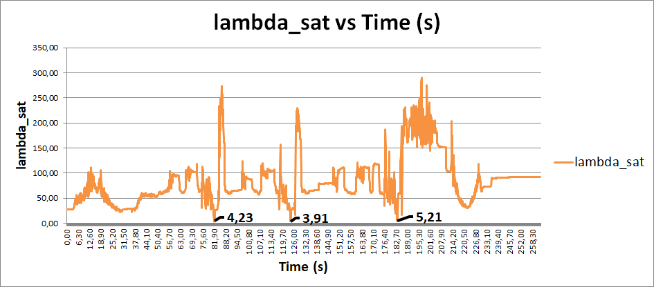

# A-Pragmatic-Framework-for-Mobile-Redundant-Manipulator-Performing-Sequential-Tasks
In this paper, a framework combining base placement, path planning and redundancy resolution for a mobile manipulator performing sequential tasks, such as screwing, drilling or assembling tasks, is proposed. For a set of given tasks, the outputs of the proposed algorithm meet the following practical performance indicators: minimization of the number of the base positions, minimization of the number of manipulator joint configuration changes, feasibility of each task considering the force capacity of the manipulator (which takes benefit of redundancy resolution) and path planning of the end-effector motion with obstacle avoidance. The effectiveness of the proposed approach is evaluated considering a 3 DOFs mobile platform and a 7 DOFs manipulator performing screwing in an application with 42 tasks.

# I. Use-case description and objectives
Fig. 1 illustrates the application considered in this work, where a 10 DOFs mobile manipulator composed of 7 DOFs serial robot arm mounted on a 3 DOFs holonomic mobile platform has to perform a sequence of discrete tasks, such as screwing. The spatial distribution of the tasks is large enough that several mobile base motions are required. From the starting position, the mobile manipulator moves to the first base position and performs a series of screwing tasks (group 1) while avoiding self-collision and the collision between the mobile manipulator and its environment, and so on for the other tasks group.    

The application objectives are :

 
Fig. 1: Schematic diagram of a screwing application with a view of the output of the proposed method. Multiple positions of the Mobile Base (MB) are represented. Each MB position is linked to a task group.

## I.1. GOAL 1: minimizing the number of movements of the mobile base.  
The total operation time increases with the number of base positions due to: a) The mobile manipulator decelerates and then accelerates at each base position and b) due to the positioning accuracy of conventional base (a few centimeters), the resulting base position may deviate significantly from the desired position. The mobile robot has then to perform a time-consuming fine repositioning process. It is therefore essential to minimize the number of movements of the base.

## I.2. GOAL 2: task's feasibility (FCI)  
With its 10 DOFs, the mobile manipulator is a kinematically redundant system. Without loss of generality, three redundant parameters are considered in this work: the Y-axis and X-axis position of the mobile manipulator ***(YB, XB)*** (see fig. 1)  and the swivel angle ***Swiv*** (see fig. 2).
The FCI method, which determines the manipulator’s FC inside the redundancy space according to the joints configuration, is used in this study to fix the choice of the redundancy parameters. 

 
Fig. 2: Manipulator’s forms for a given pose (left) and the Swivel Angle for 3 manipulator configurations (right)

## I.3. GOAL 3: generate short paths thanks to 1. status, 2. swivel angle and 3. task's order assignment (TSP)
To generate shorter paths and improve workstation safety by removing large movements, the choice of joints configuration and task order is essential. The choice of the manipulator configurations is done thanks to two sub-criteria (see fig. \ref{Status_definition}): the manipulator's form and the swivel angle ***Swiv***. Hence, two constraints are added to maintain whenever possible: a) the same manipulator's form and b) the same swivel angle. The manipulator's form corresponds to a joint configuration for a given pose which is chosen thanks to the choice of a binary combination of the triplet (shoulder, elbow, wrist). They are eight possible combinations for the considered redundant manipulator (Kuka IIWA). The tasks order choice may be solved by using a combinatorial optimization technique: the traveling salesman problem. Additionally, in case it is not possible to fix the same form, a strategy can be implemented to limit and reduce the traveling path between two tasks: a wrist motion is shorter than a wrist+elbow+shoulder motion. Thus, a qualification of the path planning is possible.

## I.4. Proposed framework
In this paper, a base positioning method based on the end-effector pose is presented. It is a multi-objective framework combining the force capacity criteria and the minimization of the number of mobile base by exploiting the kinematic redundancy of the mobile manipulator and using the graph theory. An industrial experimentation has been done to validate screwing problems that required torque management.

This three-step framework meets efficiently the previous goals. The steps are to: a) minimize the number of the mobile base positions, b) provide redundancy resolution according to the FC at the end-effector level guaranteeing the task success and c) generate the path considering obstacle avoidance. 

Fig. 3: Proposed framework

# Visualization of the results 
In the proposed article, a result section proposed a comparison between 3 types of scenarios: 1. non-redundant, 2. pure FCI-based and 3. the proposed method. The results are about the path planning of the mobile manipulator once the mobile base positions, the tasks groups, the joint configurations have been chosen. Four criteria are considered: 1. resolution of the redundant space, 2. the path feasibility (%), 3. the path distance (°) and 4. the traveling time (s). It has to be noted that the traveling time (s) criterion has been used with the real mobile manipulator instead of the simulated one. 

The path planning of the manipulator is composed of the following segments : 
- Transport position -> Group 1 --> Transport position --> Group 2 and so on.  
Results are displayed in fig. 4. 

   
Fig. 4: Point-to-Point path planning

For each scenario and each resolution, the path planning is feasible (100\%). 
For the pure FCI-based scenario, both the path joint distance and the traveling time are higher. In this case, the manipulator form changes frequently, which is a time-consuming motion for the manipulator. 
For each resolution (5.5, 10.10 and 18.48), the FCI-Based and non-redundant scenarios are worse than the result of the proposed method.  
The improvement range of the proposed full-method vs the non-redundant scenario is: 1. between 108\% (low resolution) and 223\% (medium resolution) for the path joint distance, 2. between 127\% (small resolution) and 243\% (high resolution) for the traveling time. 
Similarly, the improvement range of the proposed full-method vs the pure FCI-based scenario is: 1. between 212\% (medium resolution) and 292\% (high resolution) for the path joint distance, 2. between 143\% (small resolution) and 207\% (medium resolution) for the traveling time. 

Fig. 5 is a summary of each scenario for each resolution. Each color corresponds to a new group of tasks (and so to a new mobile base position). The group/color references are: G1. Lavender, G2. Brown, G3. Olive, G4. Teal, G5. Navy, G6. Black, G7. Orange and G8. Beige. 

   
Fig. 5: Point-to-Point path planning

# III. Implementation
This framework is using various software: 1. MATLAB for calculus and 2. V-REP (now called COPPELIA) for input data, visualization and path planning algorithms thanks to the Open Motion Planning Library (OMPL). 

The communication between these two softwares is based on the Legacy remote API of V-REP for Matlab. A class, named "Vrep_STORE"  has been created in Matlab which allows the setting/retrieving of parameters of V-REP. Different function callback has been created from the V-REP side also. 

The output of this framework is a txt file containing the path to be executed by the mobile manipulator for each groups of tasks. 
Another step is the utilisation of this path txt file. The real manipulator (IIWA 14kg) is controlled thansk to the IDE "Sunrise Workbench" by using Java. A joint position spline is created by using the txt file and then played by the manipulator.

# IV. Explication of a few techniques used in this scientific paper.

## EXEMPLE 1 - Choice of the mobile base positions and the tasks groups.
In this small example, the mobile manipulator has to perform 34 actions which could be screwing, drilling ... The redundant space composed of the planar position of the mobile base and the angle of swivel of the manipulator has been discretized in N_Yb = N_Xb = Nswiv = 9 values. The fig. 4 represents the use case for this example. 

  
Fig. 4: Proposed use-case for this exemple

### Obtention of the reduced matrix of the feasible tasks
Based on step 0 and step 1 of the article, one can compute the following matrix (see fig. 5 - top) and its equivalent in node form (see fig. 5 - bottom). It represents for each mobile base position (Yb, Xb), the tasks which are reachables (I.K) and feasible (FCI). For example, the mobile base position (Yb=6, Xb=4) allows the reachability and the feasibility (from a force point of view) of tasks 1 to 8. 

  
Fig. 5: Reduced matrix of the feasibles tasks (top) and its node equivalence (bottom). 

In the previous figure, the root nodes (green - nodes 33, 34, 41, 42, 44, 50, 52 and 53) and the end nodes (orange - nodes 37 and 46) are represented. They correspond respectively to the nodes containing at least the task n°1 and the last task. 

### Obtention of the directed graph
Based on the two previous matrices, it is possible to create the directed graph of this application (see fig. 6). It exists in total NB(root_nodes)*NB(end_nodes)=18 possibles paths in the graph. A path is represented by a sequence of nodes, which represent the feasible tasks for a specific mobile base position. it also exits null nodes (see nodes on top of fig.6) which corresponds to the empty cells of the reduced matrix of feasible tasks. Among those 18 paths, it exists 5 paths with a length of 2 nodes, and 13 paths with a length of 3 nodes. 

A minimization of the number of nodes and a maximization of the number of feasible tasks is then performed. Among all the paths, one has been selected (in green). If it exists multiple minimum nodes path solutions, a spatial criterion is applied to differentiate the solutions. 

Finally, the retrieved path solution is :  
Groupe 1: [YB(5), XB(5)] for task 1 to task 18  
Groupe 2: [YB(1), XB(5)] for task 19 to task 34  

  
Fig. 6: Directed graph 

## EXEMPLE 2 - Choice of the swivel angle value (search by block column)
In the article, a method has been introduced but hasn't been described thoroughly: the search by block column. This method is going to be applied to a small example. It's a method that seeks a (task, swivel) form of solution which minimize the change of swivel angle value from one task to another. 

Let's consider that the use case contains only 5 tasks. Let's also consider that Nswiv = 5, meaning the swivel angle can take 5 values. Let's also consider that our input data is this reduced binary matrix for feasible forms: ***red_binFf*** (see fig. 7) where 1 corresponds to feasible and 0 to non-feasible. 

  
Fig. 7: reduced binary matrix for feasible forms ***red_binFf***

So in this matrix : 
- the first task can be realized with any value of the swivel angle.  
- the second task can only be realized with the second and third values of the swivel angle
- and so on ...

The different possibilities of this table are regrouped in fig. 8. It exists a total of 40 combinations. By using the search by block column method, a "column" solution can be retrieved. A column starts with the initial index and finishes once a zero value has been founded. Then, the research of a new column at the index of the previous zero is carried out, and so on. The "column" solution which is retrieved corresponds to the column which maximizes the number of tasks. 

  
Fig. 8: All possible combinations of task/swivel

The final result of the search by block column is presented in fig. 9 where 3 columns have been found, leading to the solution:
***(T1, Swiv2), (T2, Swiv2), (T3, Swiv2), (T4, Swiv1), (T5, Swiv3)***.

  
Fig. 9: All possible combinations of task/swivel

# V. Validation of the FCI Method
In this section, an expérimental validation of the Force Capacity Index (FCI) method is performed for 3 screws of a contactor. The desired vector force/torque f = [50N, 0N, 0N, 9Nm, 0Nm, 0Nm] is referenced in the TCP frame of the manipulator. The tightening torque is 9Nm and the strength to apply to the screw of a contactor is 50N. The initial joint configuration is represented in fig. 10. 

  
Fig. 10: Initial manipulator position for screwing. 

The weight of the tool is 3.9kg. It is composed of the electric screwdriver and its 3D-printed support, a camera Basler, and a LEDs system. It has to be noted that this tool's weight is offseted compared to the manipulator's flange, which reduced considerably the permitted payload according to the manipulator's manufacturer data (see fig. 11)

  
Fig. 11: Payload diagram - Permitted payload vs the offset of the TCP frame from the flange frame. 

The experimental results are obtained from the data present in the manipulator (collected from a dataRecorder). In total, three types of data are recovered: 1. the vector force/torque ***f*** felt by the electrical screwdriver at the TCP in the robot base frame, 2. the torque due to gravity ***Tg*** and 3. the torque due to an external force ***Tf***. From these data, the total torque ***Ttot*** (see fig. 12) for each joint and the FCI (see fig. 13) can be obtained. 
As a reminder, for a joint configuration ***q***, the FCI method search an index of saturation lambda_sat which satisfy the following equation : ***Ttot(q) = Tg(q) + lambda_sat . Tf(q)***. 

  
Fig. 12: Experimental results of the manipulator total torque for each joint. 

  
Fig. 13: Payload diagram - Permitted payload vs the offset of the TCP frame from the flange frame. 

Based on these two graphs, the experimental FCI is 4.23 for the first screw, 3.91 for the second, and finally 5.21 for the third. Theoretically, we find an FCI of 4.45 for the three screwings. There is therefore a difference of about $\pm 15$. Moreover, we can see in fig. 12 that none of the joints is in saturation compared to the limit torques of the manipulator. The screwing is therefore feasible, which can also be observed from the screwing curves recovered from the screwing machine (see fig. 14).

  
Fig. 14: Screwing curve of the electrical screwdriver for the first screw. 

